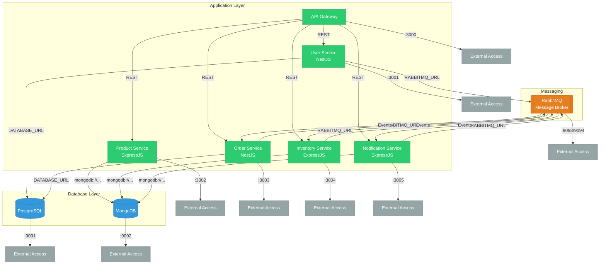

# 🛒 NodeJS Microservices: Order & Inventory System


A modular, production-ready microservices system inspired by e-commerce architectures, built with TypeScript, Node.js, NestJS, ExpressJS, PostgreSQL, MongoDB, Docker, and RabbitMQ/NATS for event-driven communication.

---

## ✨ Overview

This project demonstrates a modern microservices architecture for an Order & Inventory System, suitable for real-world companies. Each service is designed with single responsibility, clear separation, and scalable technologies.

- **Tech Focus:** TypeScript-first, RESTful APIs, event-driven messaging, containerized infrastructure
- **Monorepo:** All services managed together for easy orchestration and development
- **Best Practices:** Security, scalability, and maintainability in mind

---

## 🏗️ Architecture



| Microservice             | Tech Stack                           | DB         | Responsibility                                    |
| ------------------------ | ------------------------------------ | ---------- | ------------------------------------------------- |
| **User Service**         | NestJS                               | PostgreSQL | User registration, login, authentication, roles   |
| **Product Service**      | ExpressJS                            | MongoDB    | Product CRUD (create, update, list, delete)       |
| **Order Service**        | NestJS                               | PostgreSQL | Order creation, validation, and processing        |
| **Inventory Service**    | ExpressJS                            | MongoDB    | Stock tracking, update on orders                  |
| **Notification Service** | ExpressJS                            | MongoDB    | Email/log notifications on events                 |
| **API Gateway**          | ExpressJS/NestJS                     | -          | Unified API entry, routing, token verification    |
| **Message Broker**       | RabbitMQ/NATS                        | -          | Inter-service event bus                           |

---

## 📁 Project Structure

```bash
nodejs-microservices/
├── api-gateway/              # API Gateway (routing, auth)
├── user-service/             # User microservice
├── product-service/          # Product microservice
├── order-service/            # Order microservice
├── inventory-service/        # Inventory microservice
├── notification-service/     # Notification microservice
├── docker-compose.yml        # Infrastructure orchestration
├── docs/                     # Architecture diagrams, docs
├── README.md
```

---

## 🔗 Communication

- **API Gateway ⇄ Services:** REST (HTTP)
- **Between Services:** Messaging (RabbitMQ/NATS)
  - `OrderService` emits `order_created`
  - `InventoryService` listens and adjusts stock
  - `NotificationService` listens and sends notification

---

## 🚀 Features

### 👤 User Service
- Secure sign up & login
- JWT authentication
- Role-based access (admin/user)

### 🛍️ Product Service
- Create/list/delete products
- Fetch by product ID
- Simple MongoDB schema

### 🛒 Order Service
- Place new orders
- Validate users & product stock
- Emits `order_created` event

### 🏬 Inventory Service
- Listens to `order_created`
- Decreases stock or rejects if insufficient

### 📢 Notification Service
- Listens to events (`order_created`, etc)
- Sends notification (email/log)

### 🌍 API Gateway
- One entrypoint for frontend
- Reverse proxy, JWT verification
- Routes `/products`, `/orders`, `/users` to services

---

## 🐳 Dockerized Infrastructure

Powered by `docker-compose.yml`:

- All microservices (with build contexts)
- MongoDB, PostgreSQL databases
- RabbitMQ or NATS for messaging
- Optional admin UIs: pgAdmin, Mongo Express, RabbitMQ dashboard

```bash
docker-compose up --build
```

---

## 🛣️ Roadmap

- [ ] Add OpenAPI/Swagger docs for each service
- [ ] Service discovery and dynamic routing
- [ ] Production-ready monitoring & logging
- [ ] Integration with frontend (React/Angular)
- [ ] Advanced notification channels (SMS, Push)

---

## 🤝 Contributing

Contributions, ideas, and feedback are welcome!  
Feel free to open issues or submit pull requests.

---

## 📜 License

MIT License. See [LICENSE](LICENSE) for details.

---

## 👨‍💻 Author

**Jawher Kallel**  
[GitHub @JawherKl](https://github.com/JawherKl)

---

Made with ❤️ for scalable, real-world systems.
